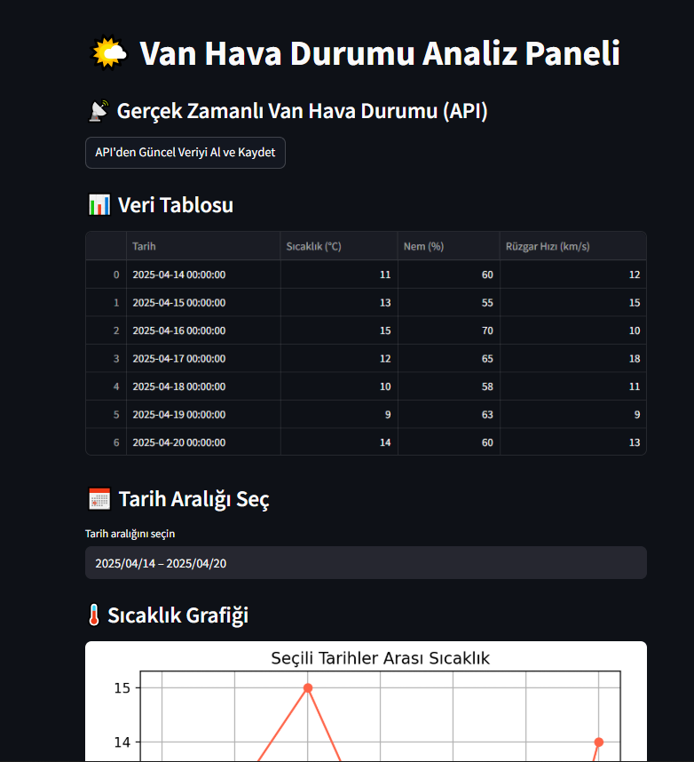
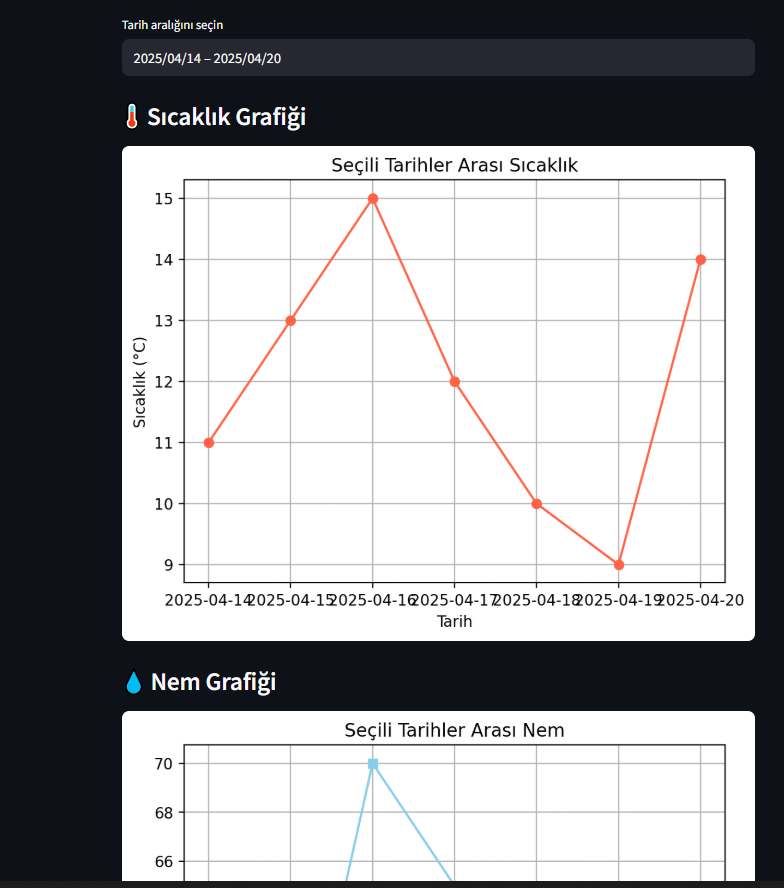
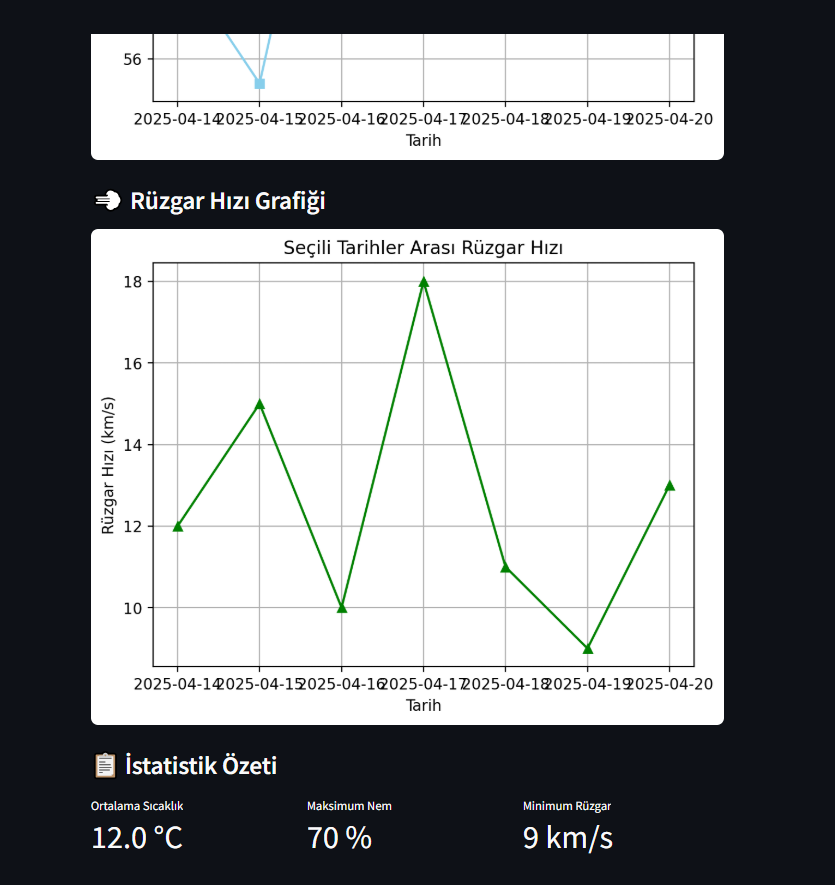
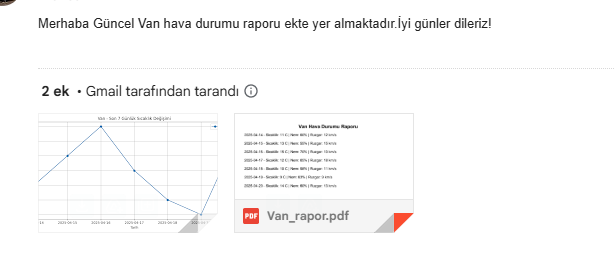
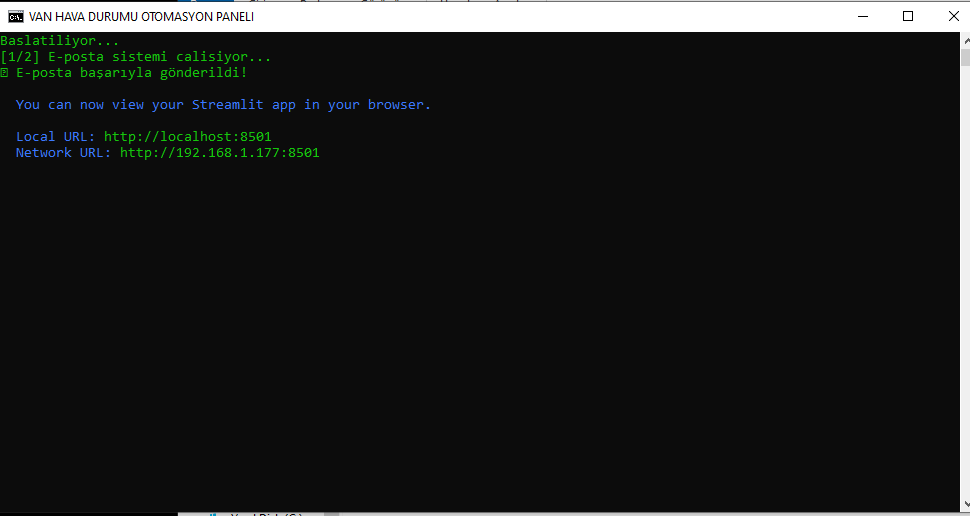

# 🌤️ Van Hava Durumu Veri Bilimi Projesi

Bu proje, Van iline ait gerçek zamanlı hava durumu verilerini OpenWeatherMap API'sinden çekerek:
- 📊 Grafikler oluşturur
- 📄 PDF raporu üretir
- 📧 Otomatik olarak e-posta gönderir
- 🌐 Streamlit ile web panel gösterimi sunar

---

## 🚀 Kullanılan Kütüphaneler

```bash
pip install streamlit pandas matplotlib requests fpdf scikit-learn
```

---

## ⚙️ Ortam Kurulumu ve Çalıştırma Adımları

### 1. Sanal Ortam Kurulumu (İsteğe Bağlı)
```bash
python -m venv van_hava_ortami
# Windows:
van_hava_ortami\Scripts\activate
# Linux/Mac:
source van_hava_ortami/bin/activate
```

### 2. Gerekli Kütüphaneleri Yükleyin
```bash
pip install --upgrade pip
pip install streamlit pandas matplotlib requests fpdf scikit-learn
```

### 3. Streamlit Panelini Başlatın
```bash
streamlit run defterler/streamlit_panel.py
```

### 4. Manuel Veri Analizi ve Mail Gönderme (Opsiyonel)
```bash
python defterler/veri_analizi.py
python defterler/mail_gonder.py
```

### 5. Her Şeyi Tek Tıkla Başlatmak İçin (.bat dosyası)
Windows kullanıcıları için hazır `.bat` dosyalarıyla her şey tek komutla başlatılabilir:

- `kusursuz_otomasyon.bat`: tüm sistemi başlatır
- `streamlit_panel_cagir.bat`: yalnızca arayüz
- `mail_gonder_cagir.bat`: yalnızca e-posta sistemi

---

## 📁 Proje Yapısı

```
VAN Hava durumu/
├── defterler/
│   ├── streamlit_panel.py
│   ├── mail_gonder.py
│   ├── veri_analizi.py
├── veriler/ → van_hava.csv
├── grafikler/ → Van_rapor.pdf, Van_grafik.png
├── .bat dosyaları
```

---

## 🌐 OpenWeatherMap API Kullanımı

1. [API Key al](https://openweathermap.org/city/298117)
2. `streamlit_panel.py` içindeki `api_key` alanını değiştir:
```python
api_key = "senin_api_key"
```

---

## ✉️ Gmail SMTP Uygulama Şifresi

1. [Google Güvenlik Sayfası](https://myaccount.google.com/security) > 2FA etkinleştir
2. “Uygulama Şifreleri” > “Mail & Windows” seç
3. `mail_gonder.py` içinde kullan:
```python
GONDEREN_EMAIL = "seninmailin@gmail.com"
SIFRE = "uygulama_sifresi"
```

---

## 📸 Uygulama Ekran Görüntüleri

### 1. Panel Arayüzü ve Veri Tablosu


### 2. Sıcaklık Grafiği ve Tarih Seçimi


### 3. Nem ve Rüzgar Hızı Grafiği


### 4. E-Posta Gönderimi ve Rapor


---

## 🧠 Geliştiren

Bu proje [Erdinç](https://github.com/DmrErdinc) tarafından hazırlanmıştır.  
Veri bilimi, otomasyon ve web arayüzleri üzerine pratik amaçlı geliştirilmiştir.

📌 *Her satır veri, her tıklama grafik!*


### 5. Otomasyon Paneli (.bat Dosyası)
Aşağıdaki ekran görüntüsü, `.bat` dosyasının başarıyla çalıştırıldığını gösterir:



---

## 🧠 Geliştiren

Bu proje [Erdinç](https://github.com/DmrErdinc) tarafından hazırlanmıştır.  
Veri bilimi, otomasyon ve web arayüzleri üzerine pratik amaçlı geliştirilmiştir.
Detaylı Bilgi için:Eraydemir300@gmail.com üzerinden iletişime geçebilirsiniz.

📌 *Her satır veri, her tıklama grafik!*
"# Python-Hava-Durumu-Veri-Bilimi" 
"# Python-Hava-Durumu-Veri-Bilimi" 
